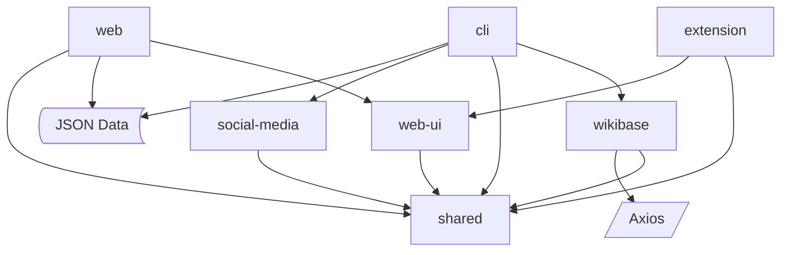

# accomplishedh

Source for my human-accomplishment project

# Roadmap

## Apps

- [ ] [cli](/apps/cli/README.md)
- [ ] [extension](/apps/extension/README.md)
- [ ] [web](/apps/web/README.md)

## Libraries

- [x] [shared](/libraries/shared/README.md)
- [x] [social-media](/libraries/social-media/README.md)
- [ ] [web-ui](/libraries/web-ui/README.md)
- [ ] [wikibase](/libraries/wikibase/README.md)

## Branches

See wiki

## Gratuitous Graph

