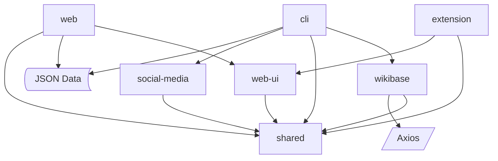

# accomplishedh

Source for my human-accomplishment project

## Apps

- [**cli**](/apps/cli/README.md) Command line program with back-office commands for operations
- [**extension**](/apps/extension/README.md) The webkit browser extension, currently avaiable in the Chrome and Edge stores
- [**web**](/apps/web/README.md) The web site

## Libraries

- [**shared**](/libraries/shared/README.md) Functions shared by the applications
- [**social-media**](/libraries/social-media/README.md) Functions for posting
- [**web-ui**](/libraries/web-ui/README.md) Functions shared by the extension and web applications
- [**wikibase**](/libraries/wikibase/README.md) Functions to search and read wikibase

## TypeScript Strategy

This repo is configured for source-first development in a pnpm workspace.

- `pnpm -r check` is the daily quality gate.
- Internal package imports (`@accomplishedh/*`) resolve to `src` via aliases in `tsconfig.json`.
- App bundlers (`Vite`/`webpack`) still control runtime builds.
- Library `dist` artifacts are optional for verification and release workflows, not required for day-to-day checks.

### Tsconfig Rationale

- `baseUrl` + `paths` in root config:
  Required today for internal source aliases. Tradeoff: deprecated in TS 6, so the config uses `ignoreDeprecations: "6.0"` until the TS 7 replacement is finalized.
- `moduleResolution: "Bundler"` in library/app package tsconfigs:
  Enables extensionless internal imports and matches bundler behavior. Tradeoff: runtime Node behavior can differ, so bundlers remain source of truth for app execution.
- Avoid `references` + `composite` for daily checks:
  Keeps checks independent of prebuilt artifacts and avoids stale build-state coupling. Tradeoff: less leverage of TypeScript project-reference incremental builds.

## Open Source

The project makes use of many open source packages

<!-- prettier-ignore -->
| Package | Functions |
| --- | --- |
| [`@google.visualization`](https://www.npmjs.com/package/@google.visualization) | Charts and Graphs for `web`'s administrative routes |
| [`@sveltejs/adapter-vercel`](https://www.npmjs.com/package/@sveltejs/adapter-vercel) | Special builds of `web` for the vercel environment |
| [`@inquirer/prompts`](https://www.npmjs.com/package/@inquirer/prompts) | Interactive prompts for `cli` |
| [`@sveltejs/kit`](https://www.npmjs.com/package/@sveltejs/kit) | Framewrok and ops for `web` |
| [`adm-zip`](https://www.npmjs.com/package/adm-zip) | Compresses `extension` for distribution to platform stores |
| [`ajv`](https://www.npmjs.com/package/ajv) | JSON schema validation for `extension` |
| [`cac`](https://www.npmjs.com/package/cac) | Command-line framework and help-generation for `cli` |
| [`cli-progress`](https://www.npmjs.com/package/cli-progress) | A progress indicator for `cli` |
| [`clipboardy`](https://www.npmjs.com/package/clipboardy) | Copies to the system clipboard for e.g., social-media posting |
| [`crypto-js`](https://www.npmjs.com/package/crypto-js) | Basic cryptographic functions e.g., `SHA256` |
| [`eslint`](https://www.npmjs.com/package/eslint) | Enforces code style and consistency throughout |
| [`eslint-plugin-gb`](https://www.npmjs.com/package/eslint-plugin-gb) | My favorite rules for style and consistency |
| [`picocolors`](https://www.npmjs.com/package/picocolors) | Terminal colors for `cli` |
| [`typescript`](https://www.npmjs.com/package/typescript) | Type-safe javascript throughout |
| [`vite`](https://www.npmjs.com/package/vite) | Bundles all packages except for `extension` |
| [`vitest`](https://www.npmjs.com/package/vitest) | Unit testing throughout |
| [`webpack`](https://www.npmjs.com/package/webpack) | Bundles `extension` for compression and posting |
| [`xml`](https://www.npmjs.com/package/xml) | Handles xml aspects for content syndication for `web` |

## Gratuitous Graph

```mermaid
flowchart TD
D@{ shape: bow-rect, label: "JSON Data "}
Axios@{ shape: lean-r, label: "Axios" }
web --> shared
web --> D
web --> web-ui
cli --> D
cli --> social-media
cli --> shared
cli --> wikibase
wikibase --> Axios
extension --> web-ui
extension --> shared
social-media --> shared
wikibase --> shared
web-ui --> shared

```
