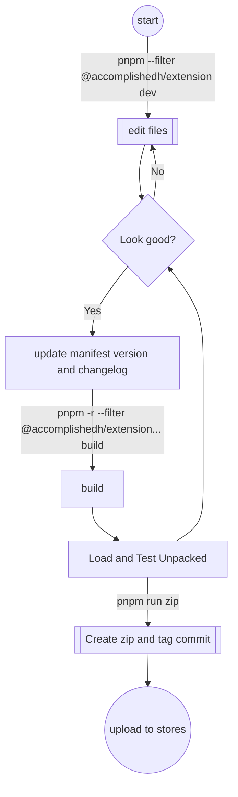

# Human Accomplishment Browser Extension

## Build Production

```shell
pnpm -r --filter @accomplishedh/extension... build
```

## Development

```shell
pnpm --filter @accomplishedh/extension dev
```



## Store Developer Dashboards

 [Partner Center Edge Workspace](https://partner.microsoft.com/en-us/dashboard/microsoftedge/overview) (Log in with GitHub)

 [Chrome Developer Dashboard](https://chrome.google.com/webstore/devconsole/b7254937-a5ff-49f5-819c-dbe00a7b5f74)
