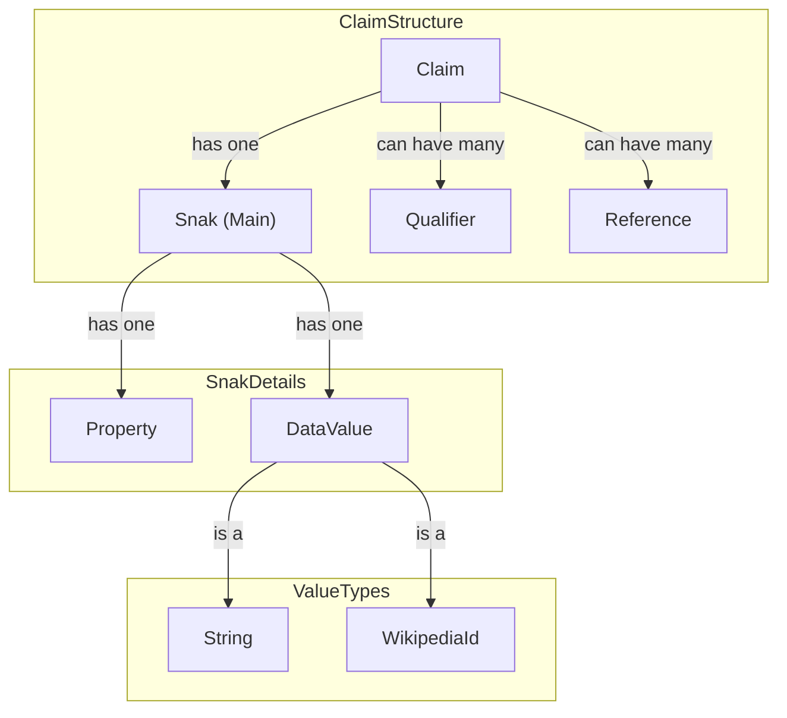
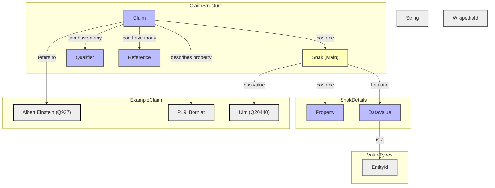

# wikibase

## References

[Wikibase/API - MediaWiki](https://www.mediawiki.org/wiki/Wikibase/API)

[wikidata.org/w/api.php?action=wbgetentities&ids=Q33725&format=json&languages=en&props=info%7Clabels](https://www.wikidata.org/w/api.php?action=wbgetentities&ids=Q33725&format=json&languages=en&props=info%7Clabels)

## Wikidata and the Semantic Web

[Wikidata:List of properties/all in one table - Wikidata](https://www.wikidata.org/wiki/Wikidata:List_of_properties/all_in_one_table)

[Help:Data type - Wikidata](https://www.wikidata.org/wiki/Help:Data_type#wikibase-item)

[CONOR.SI ID - Wikidata](https://www.wikidata.org/wiki/Property:P1280?format=json)

### More

[Wikidata Property Explorer](https://prop-explorer.toolforge.org/)

[All pages (Property namespace) - Wikidata](https://www.wikidata.org/wiki/Special:AllPages?from=&to=&namespace=120)

> Albert Einstein was born at Ulm

